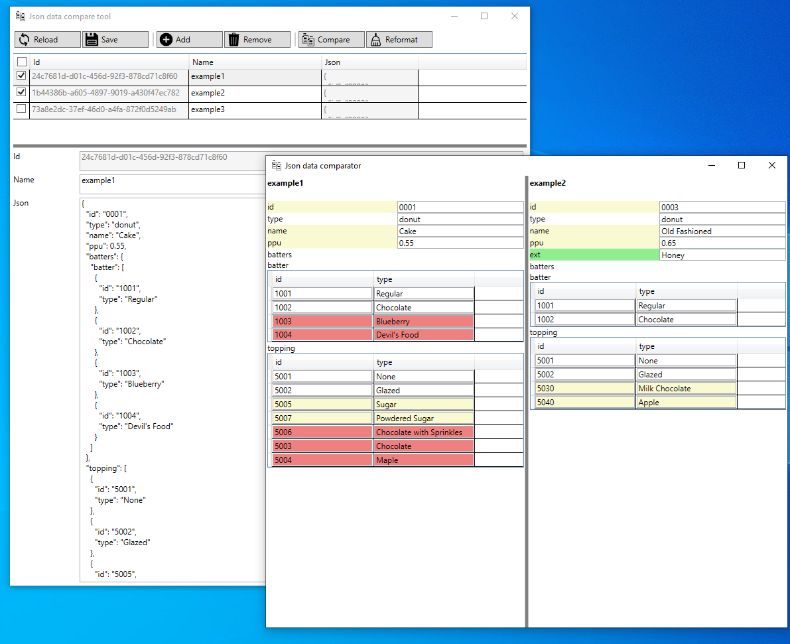

# Json View Comparer

Wpf ui control and test app to simple compare json data. Control support only json with start as json object, data can not start as array. 

### Example valid start json
```
{ "property":"value", "array":[1,2,3], "object": { "property":10}, ...}
```

### Invalid start json
```
[{"property":"value"},{"property":"value"}, ...]
```

If you need compare array, you can wrap as json object.


